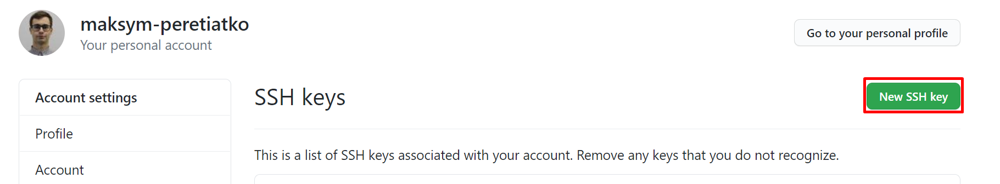
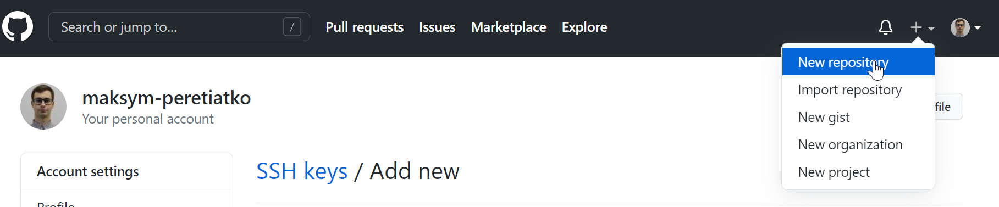
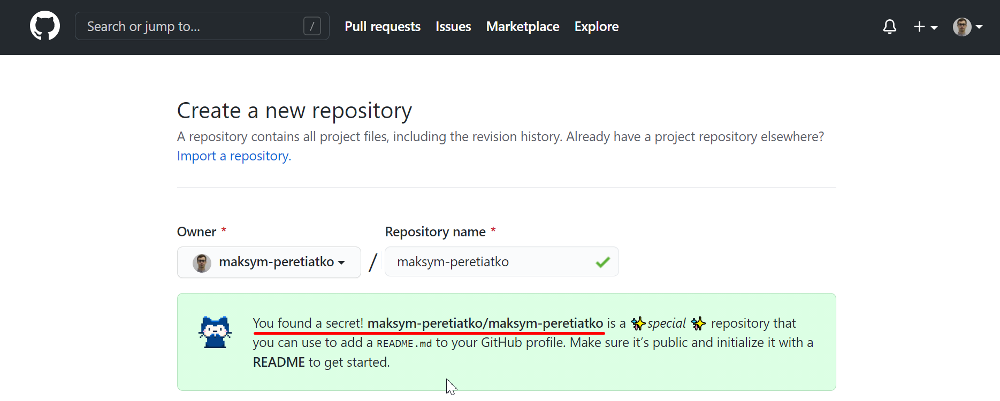
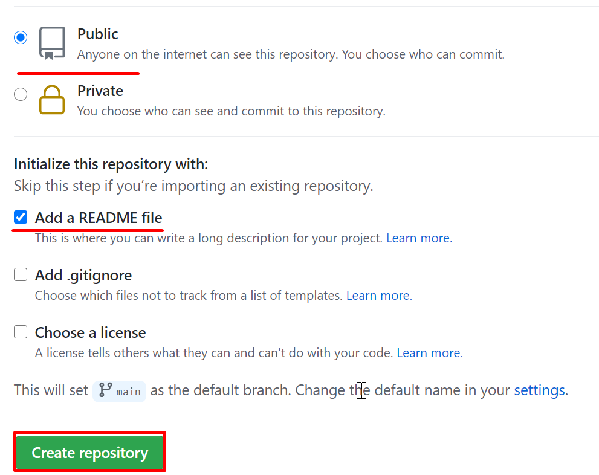
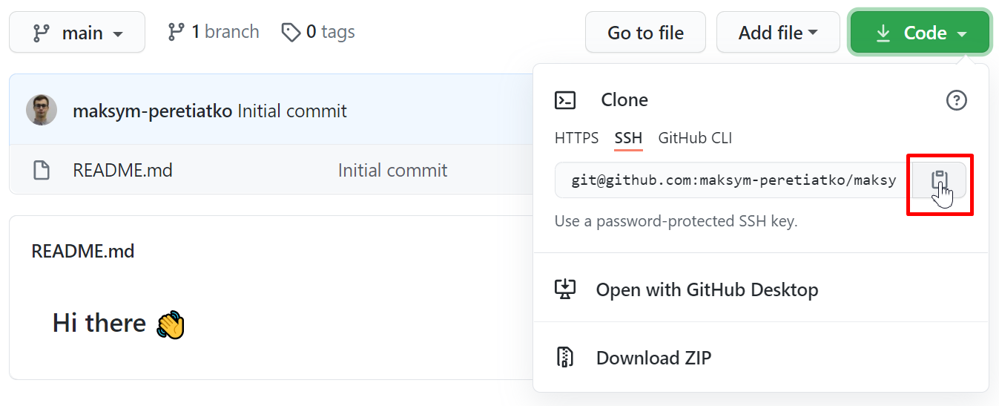

1. Create a GitHub account

https://github.com/join?ref_cta=Sign+up&ref_loc=header+logged+out&ref_page=%2F&source=header-home

2. Install CHOCOLATEY:
- run powershel as administrator
- run command:
```
Set-ExecutionPolicy Bypass -Scope Process -Force; [System.Net.ServicePointManager]::SecurityProtocol = [System.Net.ServicePointManager]::SecurityProtocol -bor 3072; iex ((New-Object System.Net.WebClient).DownloadString('https://chocolatey.org/install.ps1'))
```


3. Install git on your PC with Chocolatey :
```
choco install git -y
```

4. Configure your git:
```
git config --global user.name "John Doe"
git config --global user.email johndoe@example.com
```

5. Generate a new SSH key:

ssh-keygen -t ed25519 -C "your_email@example.com"

6. Add key to your github profile:
- copy /c/Users/you/.ssh/id_ed25519.pub 
- go to https://github.com/settings/keys
- press a button


- past copied key to a field and press a button


Reade more: https://docs.github.com/en/github/authenticating-to-github/generating-a-new-ssh-key-and-adding-it-to-the-ssh-agent

Now you are ready to use github

1. Create new repository



The name of repo should be the same as your nickname



Make shure that repo is public and initialized with readme file, then press Create repository



2. Clone repo to your PC:
- copy link

- run command to clone repo. In my case it is:
```
git clone git@github.com:maksym-peretiatko/maksym-peretiatko.git
```

3. Open README.md file with your favourite editor. 

**maksym-peretiatko/maksym-peretiatko** is a ✨ _special_ ✨ repository because its `README.md` (this file) appears on your GitHub profile.

Here are some ideas to get you started:

- 🔭 I’m currently working on ...
- 🌱 I’m currently learning ...
- 👯 I’m looking to collaborate on ...
- 🤔 I’m looking for help with ...
- 💬 Ask me about ...
- 📫 How to reach me: ...
- 😄 Pronouns: ...
- ⚡ Fun fact: ...

You can use this sujestions or create your own profile.

