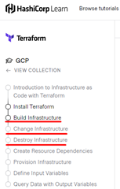

1.	Створіть обліковий запис у GCP https://cloud.google.com/
2.	Встановіть Terraform. :
choco install terraform
3.	Виконайте завдання:

https://learn.hashicorp.com/tutorials/terraform/google-cloud-platform-build?in=terraform/gcp-get-started
4.	Відправте усі файли, що будуть створені в процесі виконання завдань (окрім ключів) у свій GitHub репозиторій.
5.	Оформіть звіт.
6.	Додайте звіт у репозиторій.
